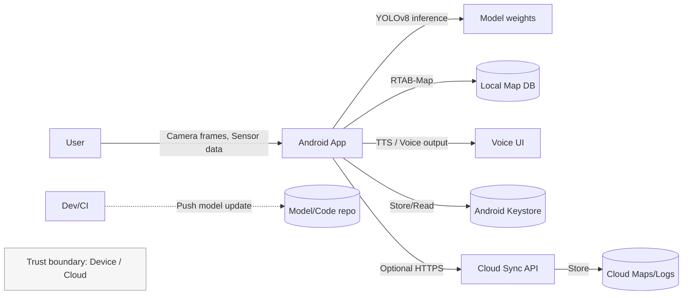

# TM - Требования безопасности + Модель угроз + ADR

> Этот файл - **индивидуальный**. Его проверяют по **rubric_TM.md** (5 критериев × {0/1/2} → 0-10).
> Подсказки помечены `TODO:` - удалите после заполнения.
> Все доказательства/скрины кладите в **EVIDENCE/** и ссылайтесь на конкретные файлы/якоря.

---

## 0) Мета

- **Проект:** Помощник для слепых — мобильное Android-приложение с on-device детекцией препятствий (YOLOv8) и построением карты окружения (RTAB-Map). Пользователи — люди с нарушением зрения; приложение работает автономно, использует камеру и инерционные датчики; оповещения — голосовые.
- **Версия (commit/date):** 0.1 / 2025-10-12
- **Кратко (1-2 предложения):** Мобильное приложение выполняет локальное обнаружение объектов и построение карты пространства, уведомляет пользователя голосом о препятствиях и прокладывает заранее подготовленные маршруты. Возможна (опционально) синхронизация карт и логов с облачным сервисом при согласии пользователя.

---

## 1) Архитектура и границы доверия (TM1, S04)

**Роли / Активы**  
- Роли: Пользователь (mobile client), Администратор/Support (в облаке, опционально), CI/CD (разработчики).  
- Важные активы: модель детекции (weights), карта окружения / локальные карты (map.db), персональные настройки и предпочтения пользователя, журналы/логи (локальные и опциональные облачные), голосовые оповещения (TTS), приватные мультимедиа (кадры/видео), криптографические ключи/сертификаты для облачной синхронизации.

**Зоны доверия**  
- Device (Mobile App — камера, микрофон, IMU, локальное хранилище).  
- Local Protected (шифрованное локальное хранилище, защищённые ключи, TPM/Keystore).  
- Internal / Optional Cloud (сервис синхронизации карт, аналитики, админ-панель).  
- Internet (внешние сервисы при включённой синхронизации).

**Context/DFD:**

**Критичные интерфейсы и допущения:**  
- Интерфейс камера→app и сенсоры считаются недоверенными вводами; все кадры валидируются/фильтруются на стороне приложения.  
- Локальное хранилище считается частично доверенным: данные шифруются с использованием Android Keystore.  
- Опциональная синхронизация в облако требует явного согласия пользователя; облачная часть считается недоверенной по умолчанию.  
- Модель (weights) при обновлении подписывается и проверяется приложением перед использованием.
---

## 2) Реестр угроз STRIDE (TM2, TM3, S04)

| ID  | STRIDE | Компонент/поток | Угроза (кратко)                                      | L | I | L×I |
|-----|--------|------------------|-----------------------------------------------------|---:|---:|----:|
| T01 | **S**  | Model update / Repo | Подмена модели (подмена weights при update) — инференс с вредоносной моделью | 3 | 5 | 15 |
| T02 | **T**  | App / Keystore   | Компрометация ключей/секретов в приложении (ключи синхронизации) | 2 | 4 | 8  |
| T03 | **R**  | Local logs/Cloud logs | Отказ от действий — отсутствие связки события↔пользователь (repudiation) | 2 | 3 | 6  |
| T04 | **I**  | Camera input / Model | Злонамеренная подача входных изображений (adversarial inputs) — evasion/false negative | 3 | 5 | 15 |
| T05 | **D**  | App runtime      | DoS — высокая загрузка CPU/GPU/памяти (heavy frames, continuous inference) | 4 | 3 | 12 |
| T06 | **E**  | Logs / Storage   | Утечка PII / мультимедиа (снимки, логи) в случае бэкапа/синхронизации | 4 | 5 | 20 |
| T07 | **S**  | Sensor input     | Подмена/спуфинг сенсорных данных (IMU/GPS spoofing) приводящая к ошибочным картам | 2 | 4 | 8  |
| T08 | **I**  | IPC / Intents    | Инъекция через интенты/URI (вредоносное deep-link) | 2 | 4 | 8  |

> Примечание: L — likelihood (вероятность), I — impact (влияние). Оценки приведены для мобильного оффлайн-приложения с опциональным облаком.

---

## 3) Приоритизация и Top-5 _(TM3, S04)_

1) **T06 Утечка PII / мультимедиа** — L×I=20. Кадры/записи и карты содержат геолокацию/персональные данные. Критично для приватности пользователей.  
2) **T01 Подмена модели** — L×I=15. Подмена злоумышленником может привести к неверному распознаванию препятствий — риск безопасности жизни.  
3) **T04 Adversarial inputs (evasion)** — L×I=15. Целенаправленные атаки на модель приводят к пропуску опасных объектов.  
4) **T05 DoS (ресурсы)** — L×I=12. Ресурсный истощение на устройстве делает приложение бесполезным в критический момент.  
5) **T02 Компрометация ключей/секретов** — L×I=8. Утечка ключей может привести к несанкционированной синхронизации или утечке данных.

Факторы приоритизации: безопасность жизни / приватность / экспозиция данных / возможность эксплуатации на массовых устройствах.

---

## 4) Требования (S03) и ADR-решения (S05) под Top-5 (TM4)

### NFR-1. Приватность мультимедиа и карт
- **AC (GWT):**  
  - **Given** пользователь включил запись/синхронизацию, **When** приложение сохраняет кадр/фрейм или карту, **Then** данные шифруются локально (AES-256 с ключом в Keystore), и при синхронизации передаётся только после пользовательского подтверждения; raw-кадры автоматически удаляются через TTL (configurable, default 14 дней).

### NFR-2. Проверка целостности и подпись модели
- **AC (GWT):**  
  - **Given** обновление модели доступно, **When** приложение получает пакет обновления, **Then** приложение проверяет цифровую подпись (PKI/JWKS) и хеш пакета; если проверка не пройдена — отклоняет обновление и логирует событие.

### NFR-3. Устойчивость к adversarial input
- **AC (GWT):**  
  - **Given** входной кадр / sequence, **When** модель делает детекцию, **Then** pipeline применяет простые детекторы качества кадра (фильтрация шумов, проверка контрастности) и sanity-check на результаты (например, резкие конфликты пересекающихся bounding boxes) — при сомнении переключится в безопасный режим (notify user: "низкая уверенность — остановитесь").

### NFR-4. Ограничение ресурсов и graceful degradation
- **AC (GWT):**  
  - **Given** доступность CPU/GPU снижена или температура высока, **When** приложение ощущает перегрузку, **Then** снижает частоту инференса / разрешение кадра и переводит в режим низкого энергопотребления; логирование p95 latency и событий throttling.

### NFR-5. Безопасное хранение секретов и согласие на синхронизацию
- **AC (GWT):**  
  - **Given** пользователь включает синхронизацию, **When** токены создаются, **Then** refresh/access токены хранятся в Keystore; доступ к облаку выполняется по OAuth2 с MFA на админ-стороне; revoke токена реализован.

---

### Краткие ADR (минимум 2) - архитектурные решения S05

#### ADR-001 — Подпись и проверка модели (Model Signing)
- **Context (угроза/NFR):** T01 (подмена модели), NFR-2.  
- **Decision:** Все модели и их веса подписываются приватным ключом организации. Приложение содержит публичный ключ/сертификат для верификации (через Android Keystore/TrustStore). При обновлении проверяется подпись и контрольная сумма. Обновления принимаются только из доверённого репозитория (HTTPS, TLS).  
- **Trade-offs:** Добавляет шаги в CI/CD и процесс выпуска модели; требует управления ключами (KMS). Это значительно повышает безопасность модели.  
- **DoD:** Проверка подписи — отказ на tampered model; unit-тесты для chain-of-trust; процесс ротации ключей описан.  
- **Owner:** Team-Security / ML Engineer.

#### ADR-002 — Политика приватности мультимедиа и опциональная синхронизация
- **Context:** T06 (утечка PII), NFR-1.  
- **Decision:** Raw изображения и локальные карты по умолчанию не покидают устройство. Синхронизация включается только по явному согласию, перед отправкой данные анонимизируются/минимизируются (удаляются кадры без явных препятствий; геометки аггрегируются). TLS + Server-side encryption при хранении в облаке.  
- **Trade-offs:** Снижение объёма данных для аналитики, сложность UX при управлении consent; сильное улучшение приватности.  
- **DoD:** По умолчанию синхронизация отключена; при включении — consent flow и раскрытие retention; доказательства в EVIDENCE.  
- **Owner:** Product Owner / Security Lead.

#### ADR-003 — Runtime resource management и защитный режим
- **Context:** T05 (DoS/resource), NFR-4.  
- **Decision:** Встроить в приложение контроллер ресурсов: мониторинг CPU/GPU/temperature; адаптивная частота инференса; fallback-mode (низкое разрешение или предупреждение и пауза). Лимиты конфигурируемы и тестируемы.  
- **DoD:** При нагрузке приложение демонстрирует graceful degradation, p95 latency укладывается в SLO.

---

## 5) Трассировка Threat → NFR → ADR → (План)Проверки (TM5)

| Threat | NFR   | ADR     | Чем проверяем (план/факт) |
|-------:|-------|---------|---------------------------|
| T06    | NFR-1 | ADR-002 | Мануальные и автоматические тесты retention/masking; E2E: включение sync → проверка что raw не уходит; SAST на точки сохранения файлов. (EVIDENCE/PII-privacy-2025-10-12.pdf) |
| T01    | NFR-2 | ADR-001 | CI/CD flow: подпись модели; тесты встраивания неподписанной модели → reject; DAST на update-endpoint. (EVIDENCE/model-sign-2025-10-12.pdf) |
| T04    | NFR-3 | ADR-00X | Adversarial robustness testing: набор атак (fgsm/patches) в тестовой среде; Fallback behaviour verification; accuracy/regression tests. (EVIDENCE/adv-test-2025-10-12.pdf) |
| T05    | NFR-4 | ADR-003 | Нагрузочное тестирование мобильного runtime (симуляторы низких ресурсов), thermal tests; измерения latency/power. (EVIDENCE/resource-tests-2025-10-12.png) |
| T02    | NFR-5 | ADR-005 | Secrets scan (gitleaks), проверка хранения токенов в Keystore; ревью CI/CD секретов. (EVIDENCE/secrets-scan-2025-10-12.txt) |

---

## 6) План проверок (мост в DV/DS)

- **SAST / Secrets / SCA:** `Gitleaks`, `Trivy`, `SpotBugs`/`Detekt` для Android. Развернуть проверки в CI (pre-merge). Отчёты в `EVIDENCE/`.  
- **Model Supply Chain Checks:** подпись артефактов моделей, проверка хешей, provenance в CI, проверки целостности на устройстве.  
- **Adversarial Testing / ML Robustness:** запустить набор тестов (FGSM, Patch, Spoofed frames) на тестовом стенде с автоматической валидацией fallback-mode.  
- **DAST / Mobile Pentest:** тестирование привилегий, Intent/URI injection, разрешений Android (camera/mic/storage), проверка экспорта/бэкапа данных.  
- **Runtime Tests:** энергопотребление, таймауты, поведение при thermal throttling; проверка p95 latency для inference.  
- **Privacy Audit:** proof-of-consent flow, retention enforcement, проверка cloud sync paths.

---

## 7) Самопроверка по рубрике TM (0/1/2)

- **TM1. Архитектура и границы доверия:** [ ] 0 [ ] 1 [x] 2  
- **TM2. Покрытие STRIDE и уместность угроз:** [ ] 0 [ ] 1 [x] 2  
- **TM3. Приоритизация и Top-5:** [ ] 0 [ ] 1 [x] 2  
- **TM4. NFR + ADR под Top-5:** [ ] 0 [ ] 1 [x] 2  
- **TM5. Трассировка → (план)проверок:** [ ] 0 [ ] 1 [x] 2

**Итог TM (сумма):** 10/10
